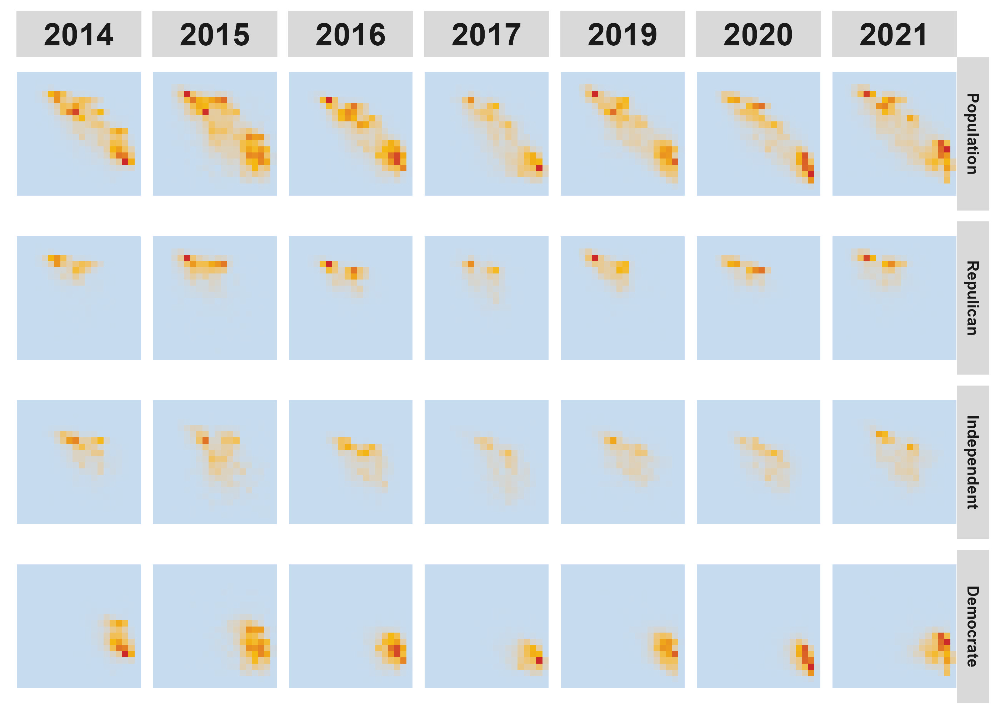
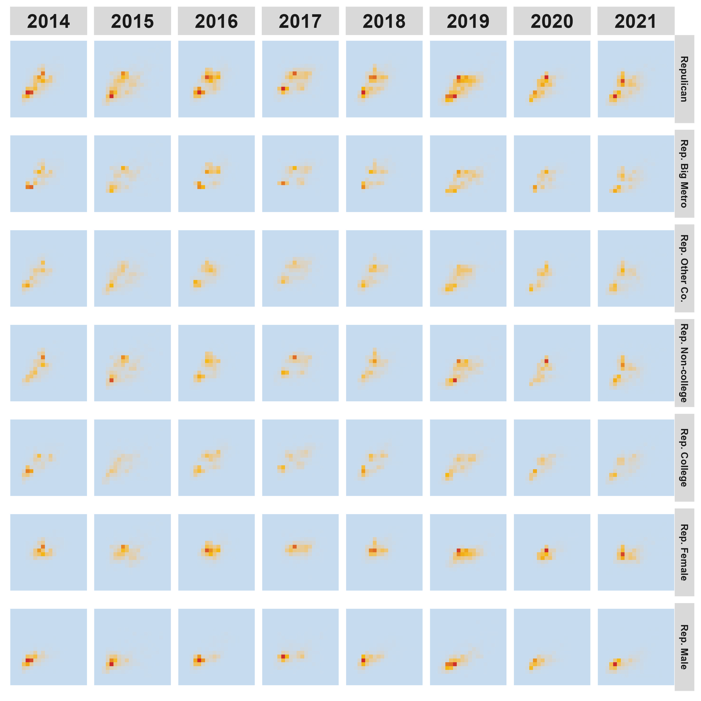

# Dissecting Survey Data with Multidimensional Visualization

## 1. Overview

This study introduces a multidimensional visualization framework for analyzing complex structures in survey-based policy preferences. Conventional analyses typically focus on individual policy issues, providing valuable insights into specific dimensions of public opinion but offering limited perspectives on how multiple attitudes interact within respondents. To address this gap, we propose a two-dimensional heatmap approach that integrates random forest (RF) predictions to account for demographic and interaction effects. This model-based visualization highlights joint patterns of policy preferences and enables interpretable exploration of multidimensional relationships in survey data. We apply the framework to national survey responses from 2014 to 2021 to illustrate how it can reveal evolving associations among key policy domains and identify systematic subgroup differences. Beyond this application, the proposed method provides a general and scalable tool for dissecting high-dimensional survey data, offering new possibilities for studying interconnected attitudes and behavioral patterns across diverse research contexts.

This repository contains the R code, processed data, and visualization scripts for the project.

---

## 2. How to Run the Project

### Step 1 — Set up the R environment
Open **PowerShell** or **Git Bash** inside the project folder and run:

```
Rscript --% -e "install.packages('renv', repos='https://cloud.r-project.org')"
Rscript --% -e "renv::restore()"
```

This installs all required R packages listed in `renv.lock`.

---

### Step 2 — Download and process data
Raw data are publicly available.  
See `data/README.md` for download links and details.

To reproduce everything from scratch, run:

```
Rscript scripts/01_download_raw.R
Rscript scripts/02_process.R
```

Or skip directly to plotting using the processed data:

```
Rscript scripts/03_make_figures.R
```

To run the entire workflow (download --> process --> plot):

```
Rscript scripts/04_reproduce_all.R
```

All generated figures will be saved to the `figs/` folder.

---

## 3. Project Highlights

Below are examples of visualization outputs:

<table>
  <tr>
    <th width="70%">Figure</th>
    <th width="30%">Description</th>
  </tr>
  <tr>
    <td>
      
    </td>
    <td>
      <b>Partisan Breakdown.</b> Heatmaps by political affiliation (Democrat, Republican, Independent) for Gun Control vs Immigration combination. Republicans are concentrated in the conservative pole, Democrats in the liberal pole, and Independents occupy intermediate or mixed regions. This pattern indicates that partisanship largely explains the distinct poles in the population distribution.
    </td>
  </tr>
  <tr>
    <td>
      
    </td>
    <td>
      <b>Subgroup Analysis.</b> Subgroup breakdown for Republicans. The overall two-pole structure, pro-environment/pro-gun-control vs anti-environment/permissive-gun, persists across geography and education but disappears when stratified by gender, indicating that gender explains most of the within-party divide.
    </td>
  </tr>
</table>

For more figures and explanations, see the `docs/` folder.

---

## 4. Data Sources
- **Public Political Preference Survey Dataset** Cumulative CES Policy Preferences (2014-2021):  
  [https://doi.org/10.7910/DVN/OSXDQO](https://doi.org/10.7910/DVN/OSXDQO)
- **Corresponding Demographic Survey** Cumulative CES Common Content:  
  [https://doi.org/10.7910/DVN/II2DB6](https://doi.org/10.7910/DVN/II2DB6)

See `data/README.md` for details on downloading and variable definitions.

---

## 5. Contact
For questions or collaboration:
- **Author:** [Your Name]  
- **Email:** [your_email@domain.edu]  
- **Institution:** Oregon State University
